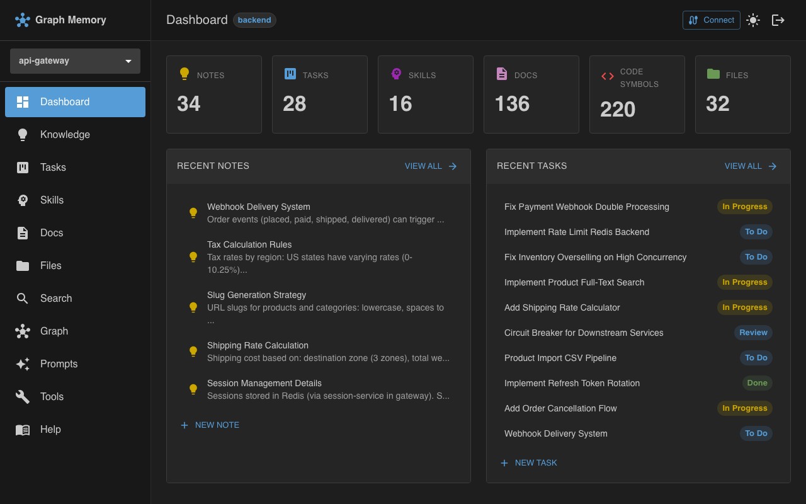

# graphmemory

[](https://www.npmjs.com/package/@graphmemory/server)
[](https://github.com/graph-memory/graphmemory/actions/workflows/ci.yml)
[](LICENSE)
[](https://codecov.io/github/graph-memory/graphmemory)

An MCP server that builds a **semantic graph memory** from a project directory.
Indexes markdown docs, TypeScript/JavaScript source code, and all project files into graph structures,
then exposes them as **70 MCP tools** + **REST API** + **Web UI**.



## Quick start

```bash
npm install -g @graphmemory/server
cd /path/to/my-project
graphmemory serve
```

That's it. No config file needed — the current directory becomes your project. Open http://localhost:3000 for the web UI.

The embedding model (~560 MB) downloads on first startup and is cached at `~/.graph-memory/models/`.

### Connect an MCP client

**Claude Code:**

```bash
claude mcp add --transport http --scope project graph-memory http://localhost:3000/mcp/my-project
```

**Claude Desktop** — add via **Settings > Connectors**, enter the URL:

```
http://localhost:3000/mcp/my-project
```

**Cursor / Windsurf / other clients** — enter the URL directly in settings:

```
http://localhost:3000/mcp/my-project
```

The project ID is your directory name. Multiple clients can connect simultaneously.

### With a config file

For multi-project setups, custom embedding models, auth, or workspaces — create `graph-memory.yaml`:

```yaml
projects:
  my-app:
    projectDir: "/path/to/my-app"
  docs-site:
    projectDir: "/path/to/docs"
    graphs:
      code:
        enabled: false
```

```bash
graphmemory serve --config graph-memory.yaml
```

See [docs/configuration.md](docs/configuration.md) for full reference and [graph-memory.yaml.example](graph-memory.yaml.example) for all options.

### Docker

```bash
docker run -d \
  --name graph-memory \
  -p 3000:3000 \
  -v $(pwd)/graph-memory.yaml:/data/config/graph-memory.yaml:ro \
  -v /path/to/my-app:/data/projects/my-app:ro \
  -v graph-memory-models:/data/models \
  ghcr.io/graph-memory/graphmemory-server
```

Docker Compose:

```yaml
services:
  graph-memory:
    image: ghcr.io/graph-memory/graphmemory-server
    ports:
      - "3000:3000"
    volumes:
      - ./graph-memory.yaml:/data/config/graph-memory.yaml:ro
      - /path/to/my-app:/data/projects/my-app
      - models:/data/models
    restart: unless-stopped
    depends_on:
      redis:
        condition: service_healthy

  redis:
    image: redis:7-alpine
    restart: unless-stopped
    volumes:
      - redis-data:/data
    healthcheck:
      test: ["CMD", "redis-cli", "ping"]
      interval: 10s
      timeout: 3s
      retries: 3

volumes:
  models:
  redis-data:
```

> Redis is optional. Remove the `redis` service and `depends_on` if you don't need shared session store or embedding cache.

See [docs/docker.md](docs/docker.md) for details.

## What it does

| Feature | Description |
|---------|-------------|
| **Docs indexing** | Parses markdown into heading-based chunks with cross-file links and code block extraction |
| **Code indexing** | Extracts AST symbols (functions, classes, interfaces) via tree-sitter |
| **File index** | Indexes all project files with metadata, language detection, directory hierarchy |
| **Knowledge graph** | Persistent notes and facts with typed relations and cross-graph links |
| **Task management** | Kanban workflow with priorities, assignees, and cross-graph context |
| **Skills** | Reusable recipes with steps, triggers, and usage tracking |
| **Hybrid search** | BM25 keyword + vector cosine similarity with BFS graph expansion |
| **Real-time** | File watching + WebSocket push to UI |
| **Multi-project** | One process manages multiple projects from a single config |
| **Workspaces** | Share knowledge/tasks/skills across related projects |
| **Auth & ACL** | Password login (JWT), API keys, OAuth 2.0 (PKCE), 4-level access control |

## 70 MCP tools

| Group | Tools |
|-------|-------|
| **Context** | `get_context` |
| **Docs** | `docs_list_files`, `docs_get_toc`, `docs_search`, `docs_get_node`, `docs_search_files`, `docs_find_examples`, `docs_search_snippets`, `docs_list_snippets`, `docs_explain_symbol`, `docs_cross_references` |
| **Code** | `code_list_files`, `code_get_file_symbols`, `code_search`, `code_get_symbol`, `code_search_files` |
| **Files** | `files_list`, `files_search`, `files_get_info` |
| **Knowledge** | `notes_create`, `notes_update`, `notes_delete`, `notes_get`, `notes_list`, `notes_search`, `notes_create_link`, `notes_delete_link`, `notes_list_links`, `notes_find_linked`, `notes_add_attachment`, `notes_remove_attachment` |
| **Tasks** | `tasks_create`, `tasks_update`, `tasks_delete`, `tasks_get`, `tasks_list`, `tasks_search`, `tasks_move`, `tasks_reorder`, `tasks_link`, `tasks_create_link`, `tasks_delete_link`, `tasks_find_linked`, `tasks_add_attachment`, `tasks_remove_attachment` |
| **Epics** | `epics_create`, `epics_update`, `epics_delete`, `epics_get`, `epics_list`, `epics_search`, `epics_link_task`, `epics_unlink_task` |
| **Skills** | `skills_create`, `skills_update`, `skills_delete`, `skills_get`, `skills_list`, `skills_search`, `skills_recall`, `skills_bump_usage`, `skills_link`, `skills_create_link`, `skills_delete_link`, `skills_find_linked`, `skills_add_attachment`, `skills_remove_attachment` |

## Web UI

Dashboard, Knowledge (notes CRUD), Tasks (kanban board with drag-drop), Skills (recipes),
Docs browser, Code browser (symbols, edges, source), Files browser, Prompts (AI prompt generator),
Search (cross-graph), Tools (MCP explorer), Help.

Light/dark theme. Real-time WebSocket updates. Login page when auth is configured.

## Authentication

```yaml
users:
  alice:
    name: "Alice"
    email: "alice@example.com"
    apiKey: "mgm-key-abc123"
    passwordHash: "$scrypt$65536$..."   # generated by: graphmemory users add

server:
  jwtSecret: "your-secret"
  defaultAccess: rw
  redis:                              # optional: session store + embedding cache
    enabled: true
    url: "redis://localhost:6379"
```

- **UI login**: email + password → JWT cookies (httpOnly, SameSite=Strict)
- **API access**: `Authorization: Bearer <apiKey>`
- **OAuth 2.0**: Authorization Code + PKCE (S256) with frontend consent page at `/ui/auth/authorize`; also supports client credentials and refresh tokens
- **OAuth endpoints**: `/api/oauth/userinfo`, `/api/oauth/introspect`, `/api/oauth/revoke`, `/api/oauth/end-session`
- **ACL**: graph > project > workspace > server > defaultAccess (`deny` / `r` / `rw`)
- **Redis** (optional): when `server.redis` is configured, used for OAuth session store and embedding cache

See [docs/authentication.md](docs/authentication.md).

## Development

```bash
npm run dev              # tsc --watch (backend)
cd ui && npm run dev     # Vite on :5173, proxies /api → :3000
npm test                 # 1809 tests across 45 suites
```

## Documentation

Full documentation is in [docs/](docs/README.md):

- **Concepts**: [docs indexing](docs/concepts-docs-indexing.md), [code indexing](docs/concepts-code-indexing.md), [tasks](docs/concepts-tasks.md), [skills](docs/concepts-skills.md), [knowledge](docs/concepts-knowledge.md), [file index](docs/concepts-file-index.md)
- **Architecture**: [system architecture](docs/architecture.md), [graphs overview](docs/graphs-overview.md), [search algorithms](docs/search.md), [embeddings](docs/embeddings.md)
- **API**: [REST API](docs/api-rest.md), [MCP tools guide](docs/mcp-tools-guide.md), [WebSocket](docs/api-websocket.md)
- **Operations**: [CLI](docs/cli.md), [configuration](docs/configuration.md), [Docker](docs/docker.md), [npm](docs/npm-package.md)
- **Security**: [authentication](docs/authentication.md), [security](docs/security.md)
- **UI**: [architecture](docs/ui-architecture.md), [features](docs/ui-features.md), [patterns](docs/ui-patterns.md)
- **Development**: [testing](docs/testing.md), [API patterns](docs/api-patterns.md)

## Contributing

Contributions are welcome! See [CONTRIBUTING.md](CONTRIBUTING.md) for guidelines.

For security vulnerabilities, see [SECURITY.md](SECURITY.md).

## License

[Elastic License 2.0 (ELv2)](LICENSE) — free to use, modify, and self-host. Not permitted to offer as a managed/hosted service.
