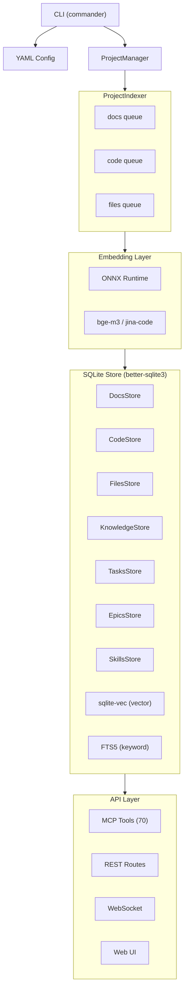

# Architecture

## High-level diagram



## Layers

### 1. CLI Layer

Entry point: `src/cli/index.ts` (Commander.js). Three main commands (`index`, `mcp`, `serve`) plus a `users` command for managing user accounts.

### 2. Configuration Layer

`src/lib/multi-config.ts` — parses `graph-memory.yaml` via Zod schemas. Validates all fields, applies defaults, resolves embedding inheritance chain. See [Configuration](configuration.md).

### 3. Project Management Layer

`src/lib/project-manager.ts` — `ProjectManager` class manages multiple project instances. Each project has its own graphs, embed functions, indexer, watcher, and mutation queue.

### 4. Indexing Layer

`src/cli/indexer.ts` — `ProjectIndexer` walks the project directory, dispatches files to three serial queues (docs, code, file index). During initial indexing, queues run sequentially by phase (docs → files → code) to minimize peak memory; after that, the chokidar watcher dispatches to all queues in parallel. See [Indexer](indexer.md) and [Watcher](watcher.md).

### 5. Embedding Layer

`src/lib/embedder.ts` — named model registry with lazy loading and deduplication. Models are registered at startup but the ONNX pipeline is only created on first use, reducing peak memory. ONNX sessions use memory-optimized options (`enableCpuMemArena: false`, `enableMemPattern: false`, sequential execution). Supports local ONNX models via `@huggingface/transformers` and remote HTTP proxies. See [Embeddings](embeddings.md).

### 6. Storage Layer

`src/store/` — SQLite-based storage (better-sqlite3 + sqlite-vec + FTS5). One database per workspace with project-scoped stores for each graph type. See [Graphs Overview](graphs-overview.md).

### 7. API Layer

Three interfaces to the graph layer:

- **MCP Tools** (`src/api/tools/`) — 70 tools exposed via MCP protocol (HTTP)
- **REST API** (`src/api/rest/`) — Express routes for CRUD + search
- **WebSocket** (`src/api/rest/websocket.ts`) — real-time event push

### 8. UI Layer

`ui/` — React 19 + MUI 7 web application. Feature-Sliced Design architecture. See [UI Architecture](ui-architecture.md).

## Directory structure

```
src/
  store/                     # SQLite storage layer
    types/                   # Store interfaces (Store, ProjectScopedStore, per-graph stores)
    sqlite/                  # SQLite implementation (better-sqlite3)
      store.ts               # SqliteStore — main implementation
      stores/                # Per-graph stores (docs, code, files, knowledge, tasks, epics, skills, attachments)
      lib/                   # Helpers (db, migrate, search, edge-helper, entity-helpers)
      migrations/            # Schema migrations (PRAGMA user_version)
  cli/
    index.ts                 # Commander CLI (3 commands + users)
    indexer.ts               # ProjectIndexer (3 queues, scan, watch, drain)
  lib/
    multi-config.ts          # Multi-project config (YAML + Zod)
    project-manager.ts       # Multi-project lifecycle + creates managers
    promise-queue.ts         # Serial PromiseQueue
    embedder.ts              # Embeddings (@huggingface/transformers)
    watcher.ts               # File watching (chokidar)
    frontmatter.ts           # YAML frontmatter + markdown serialization/parsing
    file-mirror.ts           # File mirror helpers (write/delete .notes/ .tasks/ .skills/)
    file-import.ts           # Reverse import from mirror files
    mirror-watcher.ts        # MirrorWriteTracker + watcher for reverse import
    access.ts                # Access resolution (5-level chain) + API key lookup
    jwt.ts                   # Password hashing (scrypt), JWT tokens, cookie helpers
    team.ts                  # Team directory scanning (.team/*.md)
    parsers/
      docs.ts                # Markdown → Chunk[]
      code.ts                # TS/JS → ParsedFile (tree-sitter AST)
      codeblock.ts           # Symbol extraction from code blocks
    store-manager.ts         # StoreManager (lifecycle, project-scoped access)
  api/
    index.ts                 # createMcpServer() + HTTP transport
    rest/
      index.ts               # Express app + auth middleware + SPA fallback
      validation.ts          # Zod schemas + validation middleware
      knowledge.ts           # Knowledge REST routes
      tasks.ts               # Task REST routes
      skills.ts              # Skills REST routes
      docs.ts                # Docs search routes
      code.ts                # Code search routes
      files.ts               # Files REST routes
      tools.ts               # Tools explorer REST routes
      websocket.ts           # WebSocket server
      embed.ts               # POST /api/embed endpoint
    tools/
      docs/                  # 10 MCP doc tools
      code/                  # 5 MCP code tools
      knowledge/             # 12 MCP knowledge tools
      tasks/                 # 17 MCP task tools
      epics/                 # 8 MCP epic tools
      skills/                # 14 MCP skill tools
      file-index/            # 3 MCP file index tools
      context/               # 1 MCP context tool
  tests/
    *.test.ts                # Jest test suites
    helpers.ts               # Test utilities (fakeEmbed, setupMcpClient)
    __mocks__/               # Jest mocks for ESM-only packages
    fixtures/                # Test fixtures (markdown, TypeScript)
ui/
  src/                       # React UI (FSD architecture)
  vite.config.ts             # Vite config with /api proxy
```

## Data flow

### Indexing flow

```
File on disk
  → chokidar detects add/change
  → micromatch checks patterns (docs/code/exclude)
  → parser extracts structure (markdown chunks / AST symbols / file stats)
  → embedBatch() computes embeddings via transformers.js
  → store upsert (SQLite + FTS5 + sqlite-vec)
  → WebSocket broadcasts event to UI
```

### Query flow

```
Client request (MCP tool call or REST API)
  → tool handler / REST route (thin adapter)
  → store method (e.g. scoped.knowledge.search(query))
  → query embedding computed
  → hybrid search: FTS5 keyword + sqlite-vec cosine + RRF fusion
  → results ranked by score, filtered by minScore
  → response sent back
```

### Cross-graph link flow

```
notes_create_link(fromNote, targetNodeId, targetGraph="docs")
  → check target exists in docs graph
  → create proxy node @docs::targetNodeId in knowledge graph (empty embedding)
  → create edge: fromNote → @docs::targetNodeId with kind
  → proxy excluded from list/search (ID starts with @)

When target file is removed from docs graph:
  → cleanupProxies() finds orphaned @docs:: proxies
  → removes proxy nodes and their edges
```

### File mirror flow

```
Store mutation (create/update/delete/move)
  → SQLite write (entity + FTS5 + vec0 + edges)
  → emit event (→ WebSocket → UI)
  → mirrorNote/mirrorTask/mirrorSkill
      → read attrs + edges from store
      → serialize to markdown with YAML frontmatter
      → writeFileSync to .notes//.tasks//.skills/
  → deleteMirrorDir() on delete (removes directory + attachments)
```

## Concurrency model

### PromiseQueue

`src/lib/promise-queue.ts` — serial Promise chain. Each enqueued function runs only after the previous one completes.

Used in two contexts:
- **Per-project MutationQueue** — serializes create/update/delete tool calls across parallel MCP sessions
- **Indexer queues** — serializes per-queue indexing (docs, code, files are three independent queues)

Read-only tools (list, get, search) run without queueing — SQLite WAL mode supports concurrent reads.

## Dependencies

### Backend

| Package | Purpose |
|---------|---------|
| `@modelcontextprotocol/sdk` | MCP server + StreamableHTTP transport |
| `@huggingface/transformers` | Embedding models (ONNX runtime) |
| `better-sqlite3` | SQLite database |
| `sqlite-vec` | Vector similarity search extension |
| `chokidar` | File system watching |
| `commander` | CLI argument parsing |
| `express` + `cors` | REST API |
| `multer` | Multipart file upload (attachments) |
| `ws` | WebSocket server |
| `jsonwebtoken` | JWT token signing/verification |
| `cookie-parser` | Cookie parsing for JWT auth |
| `yaml` | YAML config parsing |
| `zod` | Schema validation |
| `micromatch` | Glob pattern matching |
| `mime` | IANA MIME type lookup |
| `web-tree-sitter` + `@vscode/tree-sitter-wasm` | AST parsing (WASM grammars) |

### Frontend

| Package | Purpose |
|---------|---------|
| `react` + `react-dom` | UI framework (v19) |
| `react-router-dom` | Client-side routing (v7) |
| `@mui/material` + `@mui/icons-material` | Component library (v7) |
| `react-markdown` + `remark-gfm` | Markdown rendering |
| `@uiw/react-md-editor` | Markdown editor |
| `vite` | Build tool + dev server (v8) |
