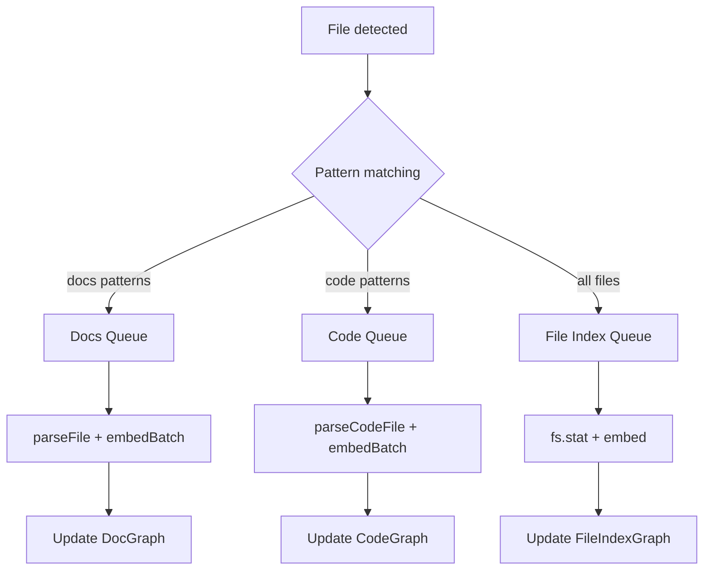

# Indexing Pipeline

The indexer (`src/cli/indexer.ts`) walks the project directory and dispatches files to three serial queues for parsing and embedding. During initial indexing, the queues run sequentially by phase to reduce peak memory usage; after that, the file watcher dispatches to all queues in parallel.

## Architecture



## Three-phase sequential indexing

During initial indexing, the three queues run **sequentially by phase** rather than concurrently. This ensures only one embedding model is loaded at a time, reducing peak memory:

```
Phase 1: docs   → scan(docs)  + drain(docs)   — triggers jina-small lazy load
Phase 2: files  → scan(files) + drain(files)  — reuses jina-small (already loaded)
Phase 3: code   → scan(code)  + drain(code)   — triggers jina-code lazy load
Finalize:  rebuildDirectoryStats, resolvePendingLinks, scanMirrorDirs (K/T/S)
```

The `IndexPhase` type defines the three phases: `"docs" | "files" | "code"`. `ProjectManager.startIndexingPhase(phase)` runs `scan(phase)` + `drain(phase)` for a single phase, and `ProjectManager.finalizeIndexing()` runs the post-indexing steps.

After initial indexing completes, the chokidar watcher dispatches to all three queues concurrently as before.

## Serial queues

Each queue is a Promise chain — `queue = queue.then(fn).catch(log)`. Errors are logged to stderr but don't stop the queue.

### Docs queue

1. `parseFile()` — parses markdown into `Chunk[]` (heading-based sections + code blocks)
2. `embedBatch()` — embeds all chunks in one forward pass
3. `updateFile()` — replaces nodes and edges in DocGraph

### Code queue

1. `parseCodeFile()` — extracts AST symbols via tree-sitter
2. `embedBatch()` — embeds all symbols in one forward pass
3. `updateCodeFile()` — replaces nodes and edges in CodeGraph

### File index queue

1. `fs.stat()` — reads file size, mtime
2. `embed()` — embeds the file path
3. `updateFileEntry()` — adds/updates node in FileIndexGraph

## Dispatch logic

When a file is detected:

1. Check against `exclude` — if matches, skip entirely
2. Check against `graphs.docs.include` — if matches, enqueue to docs queue
3. Check against `graphs.code.include` — if matches, enqueue to code queue
4. **All non-excluded files** are always enqueued to the file index queue
5. Check if graph is `enabled: false` — disabled graphs skip their queue

A single file can be dispatched to multiple queues (e.g. a `.ts` file goes to both code and file index queues).

## Operations

### `scan(phase?)`

Walks `projectDir` recursively with `fs.readdirSync`. For each entry:
- Skips dotfiles/dotdirs (names starting with `.`)
- Skips `ALWAYS_IGNORED` directories (`node_modules`, `dist`, `build`, etc.) at any nesting level
- Prunes directories matching the exclude pattern (not descended into)
- Dispatches matching files to relevant queues

When called with an `IndexPhase` argument (`"docs"`, `"files"`, or `"code"`), only dispatches files to the queue for that phase. When called without arguments, dispatches to all queues (used by the watcher).

### `watch()`

Starts a chokidar watcher on `projectDir`. Events:
- `add` / `change` → dispatched to queues (same logic as scan)
- `unlink` → enqueued removal of file's nodes from relevant graphs (serialized with adds to prevent races)

See [Watcher](watcher.md) for details.

### `drain(phase?)`

When called with an `IndexPhase` argument, waits for only the specified queue to complete. When called without arguments, waits for all three queues:

```typescript
// drain all queues
await Promise.all([docsQueue, codeQueue, fileQueue]);

// drain single phase
await docsQueue;  // drain("docs")
```

During initial indexing, `drain(phase)` is called after each `scan(phase)` to ensure one phase finishes before the next begins. The post-drain steps (rebuild directory stats, resolve pending links, scan mirror dirs) are handled separately by `ProjectManager.finalizeIndexing()`.

## Incremental indexing

Files are skipped if their `mtime` matches what's already stored in the graph node. This means:
- First indexing processes all files
- Subsequent starts only process changed files
- The `--reindex` flag forces re-processing of everything

## Batch embeddings

Docs and code queues use `embedBatch()` to embed all chunks/symbols per file in a single forward pass through the embedding model. This is more efficient than embedding one at a time.

The file index queue uses `embed()` for single items (one file path per call).

## Dangling cross-file edges

`updateCodeFile()` skips cross-file edges (e.g. `imports`) whose target node is not yet indexed. When the target file is later indexed, those edges are **not** automatically restored — the source file must be re-indexed (or a full rescan run) to pick them up.

## Cleanup on file removal

When a file is removed (`unlink` event):
1. Remove file's nodes from DocGraph and/or CodeGraph
2. Remove file's node from FileIndexGraph
3. `cleanupProxies()` — remove orphaned cross-graph proxy nodes in KnowledgeGraph, TaskGraph, and SkillGraph that pointed to the removed file's nodes

## Per-graph patterns

Each graph can have its own include and exclude patterns:

```yaml
projects:
  my-app:
    projectDir: "/path/to/my-app"
    # Server default exclude (**/node_modules/**, **/dist/**) always applies.
    # Project-level exclude adds to server defaults:
    exclude: "**/coverage/**"
    graphs:
      docs:
        include: "**/*.md"                # default
        exclude: "**/drafts/**"           # overrides project-level exclude
      code:
        include: "**/*.{js,ts,jsx,tsx,mjs,mts,cjs,cts}"   # default
```

The graph-level `exclude` overrides the project-level one (not merged).
