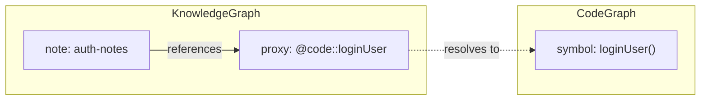

# Cross-Graph Links

Graph Memory maintains six separate graphs, but real knowledge does not live in silos. A note about authentication relates to the auth code. A deployment task references the CI config file. A skill for adding endpoints links to the route template.

Cross-graph links let you **connect any node to any other node, across graph boundaries**.

## How it works

When you create a link between nodes in different graphs, Graph Memory creates a **proxy node** in the source graph. This proxy is a lightweight placeholder that represents the target node. An edge connects your source node to the proxy, and the proxy's ID encodes where the real node lives.

```
notes_create_link({
  fromId: "auth-security-notes",
  toId: "src/lib/auth.ts::loginUser",
  targetGraph: "code",
  kind: "references"
})
```

This creates a proxy node `@code::src/lib/auth.ts::loginUser` in the Knowledge graph, with an edge from your note to that proxy.



## Proxy node format

Proxy IDs follow the pattern `@{graph}::{nodeId}`:

| Prefix | Links to |
|--------|----------|
| `@docs::` | Documentation graph |
| `@code::` | Code graph |
| `@files::` | File Index graph |
| `@tasks::` | Task graph |
| `@knowledge::` | Knowledge graph |
| `@skills::` | Skill graph |

For example:

```
@docs::guide.md::Setup        → Doc chunk "Setup" in guide.md
@code::auth.ts::Foo           → Code symbol "Foo" in auth.ts
@files::src/config.ts         → File entry in the File Index
@tasks::implement-auth        → A task
@knowledge::my-note           → A note
@skills::add-rest-endpoint    → A skill
```

:::info
Proxy nodes are invisible in normal operations. They have empty embeddings and are automatically excluded from list, get, and search results. You only see the resolved target node IDs.
:::

## Use cases

### Link a note to a code symbol

Document why a particular function exists and link the note directly to it:

```
notes_create_link({
  fromId: "why-we-use-scrypt",
  toId: "src/lib/auth.ts::hashPassword",
  targetGraph: "code",
  kind: "documents"
})
```

### Link a task to a doc section

Track which documentation section a task should update:

```
tasks_create_link({
  taskId: "update-api-docs",
  targetId: "docs/api.md::Authentication",
  targetGraph: "docs",
  kind: "relates_to"
})
```

### Link a skill to the files it operates on

Connect a skill to the actual code it modifies:

```
skills_create_link({
  skillId: "add-rest-endpoint",
  targetId: "src/api/rest/index.ts",
  targetGraph: "code",
  kind: "references"
})
```

An AI can follow that link to read current code before applying the skill's steps.

### Link a note to a file

Reference a config file from your notes:

```
notes_create_link({
  fromId: "deployment-notes",
  toId: "docker-compose.yaml",
  targetGraph: "files",
  kind: "documents"
})
```

## Viewing cross-references

Use the `docs_cross_references` tool to see all cross-graph links for a node:

```
docs_cross_references({ symbol: "loginUser" })
```

This returns all proxy connections, resolved to their actual target node IDs and graphs.

## Cross-graph links in the file mirror

When notes, tasks, or skills are mirrored to markdown files, their cross-graph relations are included in the YAML frontmatter:

```markdown
---
id: auth-security-notes
tags: [auth, security]
relations:
  - to: src/lib/auth.ts::loginUser
    graph: code
    kind: references
  - to: implement-auth
    graph: tasks
    kind: relates_to
---

# Auth Security Notes

Content here...
```

Editing these relations in the frontmatter and saving the file syncs the changes back to the graph.

## Proxy cleanup

Proxy nodes are managed automatically:

- When all edges to a proxy are removed, the proxy is deleted
- When a target file is removed from the project (e.g., a source file is deleted), orphaned proxies are cleaned up via `cleanupProxies()`
- You do not need to manage proxy lifecycle manually

## Workspaces

In workspace setups with multiple projects, cross-graph links between projects include the project name:

```
@docs::api-gateway::guide.md::Setup
```

This lets you link a note in one project to a doc section in another project within the same workspace.

:::tip
Cross-graph links become more valuable over time. As you build connections between code, documentation, notes, and tasks, search results improve — BFS expansion follows these links to surface related content you might not have found otherwise.
:::
